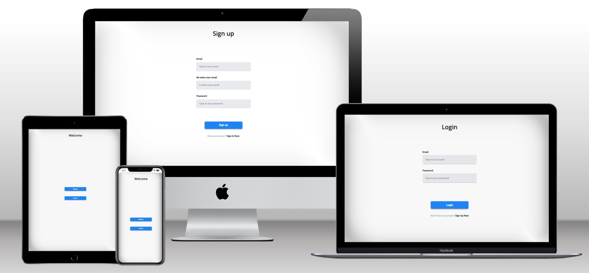

# Basic Auth

## Applications

- Front Page

- UI-kit
  
- Mocked Server (Demo solution)
  
## Documentation

- [Commit rules](./docs/commitlint.md)

## Getting Started

Run the project using the following steps:

- Copy file with environment variables and fill necessary one

```sh
cp .env.sample .env.local
```

- Generate `AUTH_SECRET` with command:
  
```sh
openssl rand -base64 32
```

- Install all dependencies

```sh
pnpm i
```

- Start the server

```sh
pnpm run dev
```

- Open [http://localhost:3000](http://localhost:3000) with your browser to see the result.

- Start UI-kit

```sh
pnpm run storybook
```

- Open [http://localhost:6006](http://localhost:6006) to explore the design system.

## Preview

<div style="display:flex; justify-content: center;">
    
</div>

## Technologies Used

- **React.js:** A popular JavaScript library for building user interfaces.
- **TypeScript:** A typed superset of JavaScript that enhances code maintainability and scalability.
- **Next.js:** A React framework that enables server-side rendering, static site generation, and other optimizations for efficient web development.
- **TailwindCSS:** A utility-first CSS framework that simplifies styling by offering a wide range of pre-defined utility classes.
